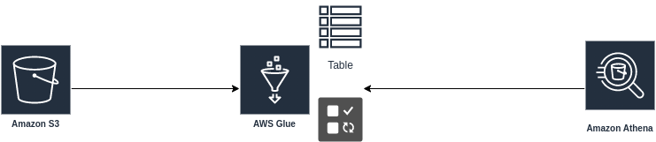

# ARQUITETURA DATA MESH

### Recursos aws
- Aws glue
- Amazon s3
- Amazon Athena

  
Para criar minha arquitetura usei o padrão Lake House, usei o amazon s3 para coletar minhas informações, kms para fazer criptografia de ponta a ponta do dados no meu s3. Para faze de etl usei o aws glue ferramenta serveles, no glue criei um job onde ele coleta meus dados no s3 e tranforme em uma tabela relacional. Para visualizar meus dados usarei o Amazon Athena.

## Desenho de solução

  

